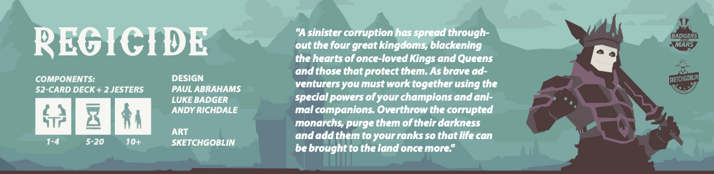

# Regicide

Regicide is a cooperative game where players work 
together to defeat 12 powerful enemies. 

Players take turns to play cards to the table to attack the 
enemy and once enough damage is dealt, the enemy is defeated. 

The players win when the last King is defeated. 

But beware! Each turn the enemy 
strikes back. Players will discard cards to satisfy the 
damage and if they can’t discard enough, everyone 
loses!

## Target platform
Desktop and Mobile.

## Game Genre
Coop Card Game (Board game).

## Game Mechanism
1. Play a card from hand to attack the enemy.
2. Activate the played card's suit power.
3. Deal damage and check to see if the enemy is defeated.
4. Suffer damage from the enemy by discarding cards.

More detailed gameplay information could be found in the official Regicide rule book [here](https://www.regicidegame.com/site_files/33132/upload_files/RegicideRulesA4.pdf).

# How to run the game
Open `index.html` to start game play.

# Copyright Information
Assets resources and rules are credited to **Badgers From Mars** 2023. More about [Regicide](https://www.regicidegame.com/).

